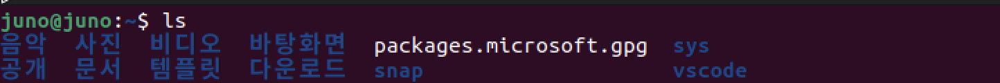
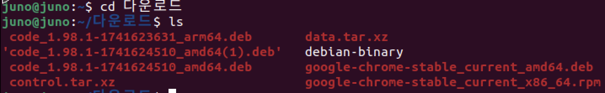
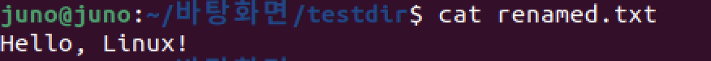

우리는 SystemProgramming을 공부하면서..
* Understanding `how the kernel works` and `how to write programs` that use these services
* System programs use those service directly
    * also known as system utilities
  
다음과 같은 과정으로 공부를 할 것이다.
1. Looking at "real" programs : `ls`, `cat`, `grep` ...
2. Looking at the "systemcall" to invoke the servies : `fork()`, `exec()`, `open()` ...
3. Writing our own version

* What does Unix do ?
  * LogIn -> Run Programs -> LogOut
  * Working with Dirctories : `cd`, `ls`, `mkdir`, `rmdir`
  * Working with Files : `touch`, `rm`, `cp`,`mv`

### 1. Working with Directories 
`ls` : list directory contents
``` bash
$ ls dirname # 해당 디렉토리에 파일들을 나열한다.
```


`cd` : change to a different directory
``` bash
$ cd dirname # 해당 디렉토리로 이동한다.
```

- `cd`를 통해 현 터미널의 주소를 다운로드로 옮긴 모습
- 다운로드 directory에서 `ls`를 하자 다운로드 dir 하위 파일들이 보인다.

`pwd` - print path to current directory
``` bash
$ pwd # 현 디렉토리의 경로를 표시한다
```


`mkdir` , `rmdir` : make and remove directories
``` bash
$ mkdir filename # filename의 디렉토리를 만든다
$ rmdir filename # filename의 디렉토리를 삭제한다
```

### 2. Working with files
`cat`,`more`,`less` : examine file contents
``` bash 
$ cat filename # filename의 내용을 확인한다
```


`cp` : make a copy of a file
``` bash 
$ cp filename copyfilename # filename의 파일을 copyfilename의 이름으로 복사한다
```

`rm` : delete a file
``` bash
$ rm filename # filename을 삭제한다
```

`lpr`,`lp` : print file on paper

`mv` : rename or move a file
``` bash
# 1. 디렉토리의 차이가 없다면 rename이다.
$ mv filename tofilename

# 2. 디렉토리의 차이가 있다면 파일을 todirname으로 이동시킨다.
$ mv filename todirname
```