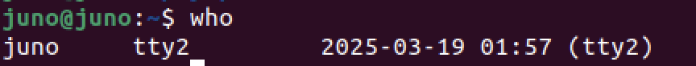
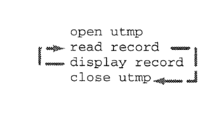
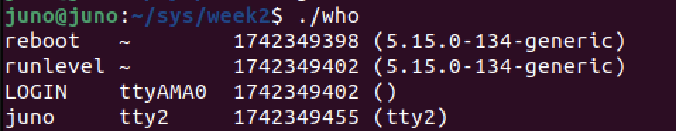

# `who` 구현하기
### 1. How does `who` Do it 
`who` : Identifies users currently logged in
``` bash 
$ who
```


* logic

    * Two tasks we need to program
      * Read structs from a file
      * Display the information stored in a struct

### 2. `open`, `read`, `close` 
* `read` : read from a file descriptor
    ``` c
    ssize_t read(int fd, void *buf, size_t count);
    // fd에 위치한 파일을 count단위로 읽어서 buf에 저장
    ```
* `open` : Opening a file
    ``` c
    fd = open(char *name, mode) ;
    // name이란 파일을 mode로 읽는다
    mode = { O_RDONLY , O_WRONLY , O_RDWR } ;
    //모드의 종류
    // 각각 읽기 전용, 쓰기전용, 읽고쓰기 모드이다.
    ```
### 2. implement
``` c
// who.c 구현
#include <stdio.h>
#include <utmp.h>
#include <fcntl.h>
#include <unistd.h>
#include <stdlib.h>
#include <utmpx.h>

#define SHOWHOST

void show_info (struct utmp*);

int main () {
    struct utmp current_record ;
    int utmpfd ;
    int reclen = sizeof(current_record);

    if( ( utmpfd = open(UTMP_FILE, O_RDONLY )) == -1 ) {
        perror(UTMP_FILE);
        exit(1);
    }
    while ( read(utmpfd, &current_record, reclen) == reclen){
        show_info(&current_record);
    }
    close(utmpfd);
    return 0;
}

void show_info( struct utmp *utbufp )
{
	printf("%-8.8s", utbufp->ut_name);
	printf(" ");					
	printf("%-8.8s", utbufp->ut_line);	
	printf(" ");						
	printf("%10ld", utbufp->ut_time);	
	printf(" ");						
#ifdef SHOWHOST
	printf("(%s) ", utbufp->ut_host);
#endif
	printf("\n");	
}
```
출력결과
