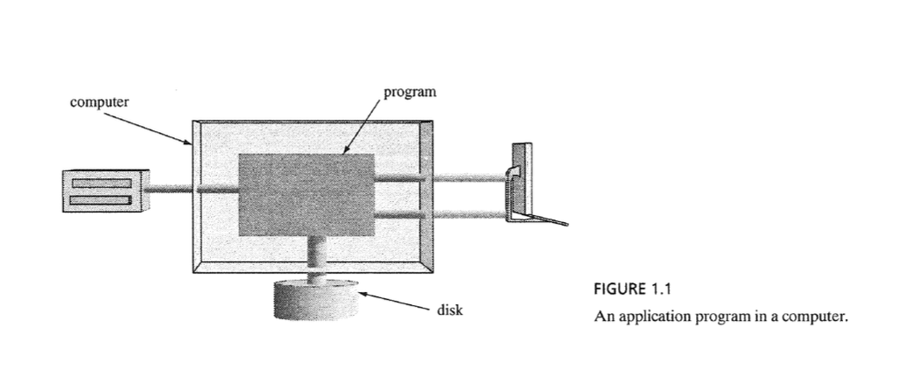
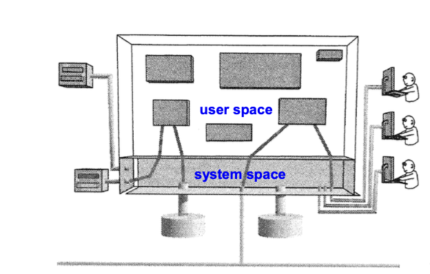
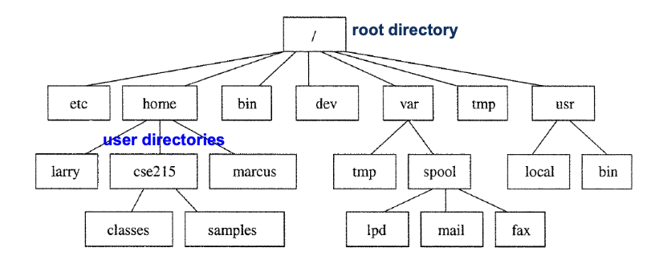
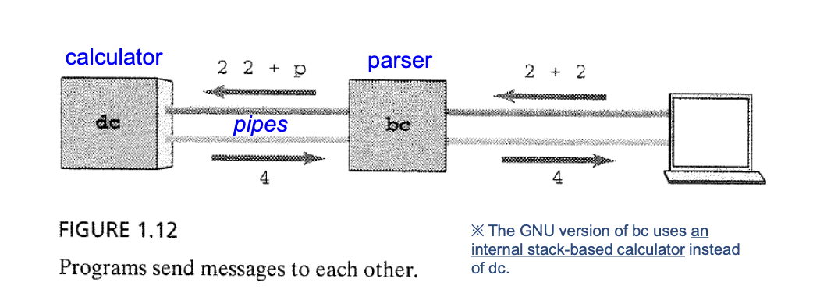

# 시스템 프로그래밍 중간고사 대비
## 1. Unix System Programming
### 1.2 What is System Programming?
#### The Simple Program Model
많은 프로그램들은 다음과 같은 모델을 따른다.



우리는 Program의 측면에서 I/O device를 통제하고 Disk를 관리하며 System을 관리할 수 있다.
* 사용자는 프로그램을 실행하고
* 프로그램은 디스크에서 데이터를 읽고 쓰며
* 프로그램은 메모리 내에서 일행된다.

이 모델은 **단일 사용자 + 단일 프로그램 + 단일 디바이스**를 가정한다.

#### Reality : Multiuser System
그러나 현실에서는 하나의 컴퓨터 시스템에 여러 사용자가 동시 접속한다.
* 다수의 사용자
* 다수의 프로그램
* 다수의 디바이스
즉, 현실의 시스템은 **Multiuser, Multiprocess, MultiDevice** 환경이다.
우리는 SystemProgramming을 통해 자원 관리, 접근 제어, 동시성 제어 등 운영체제의 기능이 필요하다.

#### Operating System
* 모든 자원들을 관리하고 보호하기 위해 사용된다.
* 여러 Device들을 Program에 연결해준다.



##### OS의 구성요소
* User space : 일반 프로그램들이 실행되는 공간
* System space : OS의 kernel이 위치한 공간. 접근이 제어된다.
* Kernel : 운영체제의 핵심. 하드웨어와 직접 통신이 가능하다.
* System Call : 사용자 프로그램 -> 커널로 서비스 요청하는 User Interface

커널은 디바이스에 **접근 가능한 유일한 프로그램**이다. 
사용자는 직접 접근이 불가하며 System call을 활용하여 제어할 수 있다.

### 1.4 Unix from the User Perspective
#### Working with Directories 
Unix는 **tree-structured dir System**을 이룬다.



##### Commands for Working with Directories
* `ls` - 디렉토리의 요소들을 나열한다.
* `cd` - 다른 디렉토리로 작업 위치를 옮긴다.
* `pwd` - 현 디렉토리의 경로를 표시한다.
* `mkdir`,`rmdir` - 디렉토리를 만들고 지운다.

##### Working with Files
* Names of Files - 파일의 이름은 **최대 255**자 까지 가능하다.
* `cat`,`more`,`less` - 파일 내용 보기
* `cp` - 파일 복사
* `rm` - 파일 삭제
* `mv` - 파일의 이름을 고치거나 옮긴다.
  * 디렉토리 위치의 차이가 있으면 옮기고, 위치 차이가 없다면 rename을 한다.
* `lpr`,`lp` - 파일을 프린터로 출력한다.

#### File Permission Attributes
사용자의 권한과 접근을 통제하기 위해 Unix에는 file에 속성을 준다.
* `ls -l` - 파일의 attributes를 표시한다.
``` bash
$ ls -l
total 4
-rw-r--r--   1 juno  staff   51  4  1 12:46 README.md
drwxr-xr-x  10 juno  staff  320  3 28 13:33 assets
drwxr-xr-x   8 juno  staff  256  4  8 12:12 assignment
drwxr-xr-x   9 juno  staff  288  3 28 13:52 docs
```
여기서 가장 앞에 있는 `drw...`가 file attributes이다.

d = directory, r = read, w = write, x = excute ...
<User>  <Group> <Other>
drwx    r-x     r-x
다음 처럼 3 비트 단위로 끊어서 읽는다.
즉 속성을 해석해본다면 아래 의미와 같다.
* 이 file은 directory이다.
* User는 read, write, excute할수 있다.
* Group과 Other 집단은 read,excute할 수 있지만 write할 수 없다.

### 1.5 Unix from the Larger Perspective
* Communication (통신)
* Process Coordination (프로세스 제어)
* Network Access (네트워크 엑세스)
#### bc Calculator
``` bash
$ bc
2 + 3
5 
#<-- press Ctrl-Z here (stop)

Stopped

$ ps
 PID  TTY        TIME    CMD
 7072 ttys086    0:00.01 bc
 7073 ttys086    0:00.01 dc # What is dc ?
# bc process is running


$ fc # continues a stopped job
#<-- press Ctrl-D here (exit)
```

`bc`는 `dc`를 사용한다. `dc`는 전위표기식을 사용하며 구조는 다음과 같다.


`user` -> `bc` -> `dc` -> `bc` -> `user` 의 형태인데,
`user`과 `bc`사이는 `device`가 통제하지만, `bc`와`dc` 사이는 `pipes`가 통제한다.

#### pipe
파이프는 프로그램과 프로그램을 이어주는 관이다.
위 예시에서 , `bc`의 출력을 `dc`의 input으로, 또 역방향으로도 작동하는것을 볼 수 있다.
* 즉 **명령어들을 연결해서 쓸 수 있다.**
``` bash
$ command1 | command2
$ cat log.txt | grep "error" | wc -l
```

## 2. Users, Files, and the Manual
### 2.2 Asking about who
``` bash
$ who
juno             console       3 31 01:10  
juno             ttys086       4 17 18:47  
#Username        terminal name       login time
```
`who`는 `/var/adm/utmp`에 위치한 파일의 정보를 불러 읽어 User's name, terminal line, login time, elapsed time을 표시한다.
* Utmp파일에 접근하기 위해서 , C언어에서 `utmp.h`헤더파일을 include 한다.
